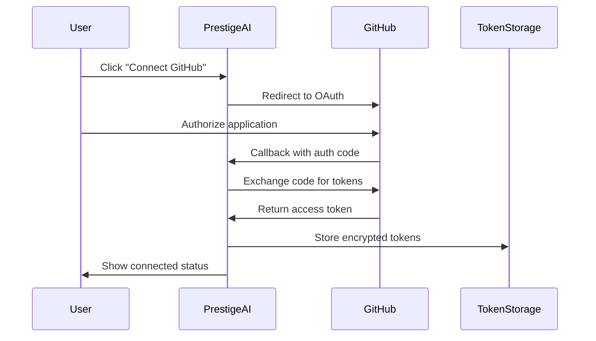

# Prestige AI Integration Setup Guide

This guide will help you set up GitHub and Supabase OAuth integrations for Prestige AI, enabling users to connect their accounts for seamless development workflow automation.

## Overview

The integration system allows users to:
- **GitHub**: Connect their GitHub accounts, create repositories, and sync code
- **Supabase**: Connect to Supabase projects, manage databases and backend services  
- **Vercel**: Deploy applications automatically (coming soon)

## Prerequisites

Before setting up integrations, ensure you have:
- A GitHub account with developer access
- A Supabase account with project creation permissions
- Basic understanding of OAuth 2.0 flows

## GitHub OAuth App Setup

### 1. Create GitHub OAuth Application

1. Navigate to [GitHub Developer Settings](https://github.com/settings/developers)
2. Click **"New OAuth App"**
3. Fill in the application details:

```
Application name: Prestige AI Desktop
Homepage URL: https://github.com/United-Visions/Prestige-Ai
Authorization callback URL: http://localhost:8080/auth/github/callback
Application description: Elite Desktop Development Platform with GitHub Integration
```

4. Click **"Register application"**

### 2. Configure Environment Variables

After creating the app, you'll receive:
- **Client ID** (public)
- **Client Secret** (private - keep secure)

Add these to your `.env` file:

```bash
# GitHub OAuth Configuration
GITHUB_CLIENT_ID=your_github_client_id_here
GITHUB_CLIENT_SECRET=your_github_client_secret_here
```

### 3. GitHub Scopes

The application requests these scopes:
- `repo`: Full control of private repositories
- `user`: Access to user profile information  
- `workflow`: Update GitHub Actions workflows

### 4. Callback URL Setup

**Desktop Application (Recommended)**: `http://localhost:8080/auth/github/callback`

Note: Port 8080 is used to avoid conflicts with the Electron development server which runs on port 5173.

## Desktop OAuth Implementation

Prestige AI uses **GitHub Device Flow** as the primary authentication method for desktop users, which is GitHub's recommended approach for desktop applications. This provides a secure authentication flow without requiring a local web server.

### Device Flow Process

1. Application requests a device code from GitHub
2. User visits GitHub's device authorization page
3. User enters the device code shown in the application
4. Application polls GitHub for authorization completion
5. Once authorized, application receives access token

This flow is already implemented in the `GitHubService.startDeviceFlow()` method.

### Fallback OAuth Flow

For advanced users or specific integration scenarios, the application also supports traditional OAuth flow using a temporary local server on port 8080.

## Supabase OAuth Setup

### 1. Create Supabase OAuth Application

1. Go to your [Supabase Dashboard](https://supabase.com/dashboard)
2. Navigate to **Settings** → **API**
3. Create a new OAuth application:

```
Name: Prestige AI Desktop
Redirect URI: http://localhost:8080/auth/supabase/callback
Scopes: Select all needed permissions (projects, organizations)
```

### 2. Environment Variables

Add to your `.env` file:

```bash
# Supabase OAuth Configuration
SUPABASE_CLIENT_ID=your_supabase_client_id
SUPABASE_CLIENT_SECRET=your_supabase_client_secret
SUPABASE_URL=https://your-project.supabase.co
SUPABASE_ANON_KEY=your_anon_key
```

### 3. PKCE Flow

Supabase uses PKCE (Proof Key for Code Exchange) for enhanced security. The implementation handles:
- Code verifier generation
- Code challenge creation
- Secure token exchange

## Vercel Integration (Coming Soon)

Vercel integration will be added in a future update. The UI components are ready but the OAuth flow is not yet implemented.

## Security Considerations

### Token Storage

The application uses encrypted token storage:

- **Web Environment**: Encrypted localStorage using Web Crypto API
- **Electron Environment**: Will use Electron's `safeStorage` API
- **Encryption**: AES-GCM with PBKDF2 key derivation

### Environment Variables

**Never commit sensitive environment variables to version control:**

1. Add `.env` to your `.gitignore`:
```bash
# Environment variables
.env
.env.local
.env.production
```

2. Use environment-specific configuration:
```bash
# Development
.env.development

# Production  
.env.production
```

### OAuth Callback Security

The callback service includes:
- State parameter validation
- Origin verification
- Timeout handling
- Error handling

## Implementation Architecture

### Core Components

1. **TokenStorageService**: Secure token storage and retrieval
2. **OAuthCallbackService**: Handles OAuth redirects and token exchange
3. **GitHubService**: GitHub API integration with persistent authentication
4. **SupabaseService**: Supabase API integration
5. **ToolsMenuDialog**: Main UI for account connections
6. **IntegrationSetupDialog**: OAuth flow UI

### Authentication Flow



## Testing the Integration

### 1. Local Development Server

Start your development server:
```bash
npm run dev
# or
yarn dev
```

### 2. Test GitHub Connection

1. Open Prestige AI
2. Click the **Tools** icon (wrench) in the header
3. Navigate to **Account Connections** tab
4. Click **Connect GitHub**
5. Authorize the application
6. Verify connection status

### 3. Test Repository Creation

1. Create or open an app in Prestige AI
2. Click the **Tools** icon
3. Navigate to **Project Actions** tab  
4. Click **Create GitHub Repository**
5. Fill in repository details
6. Verify repository creation on GitHub

## Troubleshooting

### Common Issues

1. **"OAuth error: redirect_uri_mismatch"**
   - Verify callback URL matches exactly in GitHub app settings
   - Check for trailing slashes or protocol mismatches

2. **"GitHub client secret not configured"**
   - Ensure `GITHUB_CLIENT_SECRET` is set in environment variables
   - Restart development server after adding environment variables

3. **Token storage errors**
   - Check browser console for encryption/decryption errors
   - Clear localStorage if tokens become corrupted: `localStorage.removeItem('prestige_ai_tokens')`

4. **CORS issues**
   - Ensure your development server is running on the correct port
   - Verify callback URLs match your server configuration

### Debug Mode

Enable debug logging by adding to your `.env`:
```bash
# Enable debug logging
DEBUG_OAUTH=true
```

## Production Deployment

### 1. Update Callback URLs

Update your OAuth applications with production URLs:
- GitHub: `https://yourdomain.com/auth/github/callback`  
- Supabase: `https://yourdomain.com/auth/supabase/callback`

### 2. Environment Variables

Set production environment variables:
```bash
NODE_ENV=production
GITHUB_CLIENT_ID=prod_client_id
GITHUB_CLIENT_SECRET=prod_client_secret
SUPABASE_CLIENT_ID=prod_supabase_id
SUPABASE_CLIENT_SECRET=prod_supabase_secret
```

### 3. HTTPS Requirements

OAuth providers require HTTPS for production:
- Ensure SSL certificate is valid
- Test OAuth flows on production domain
- Monitor for SSL/TLS issues

## API Rate Limits

### GitHub API Limits

- **Authenticated requests**: 5,000 per hour
- **Repository creation**: No specific limit but subject to abuse detection
- **Best practices**: Implement retry logic with exponential backoff

### Supabase API Limits

- Varies by plan and endpoint
- Monitor usage in Supabase dashboard
- Implement appropriate error handling

## Support

### Documentation

- [GitHub OAuth Documentation](https://docs.github.com/en/developers/apps/building-oauth-apps)
- [Supabase Auth Documentation](https://supabase.com/docs/guides/auth)

### Community

For issues specific to Prestige AI integrations:
1. Check this documentation first
2. Search existing issues in the repository
3. Create a new issue with detailed reproduction steps

## Security Checklist

- [ ] Environment variables are not committed to version control
- [ ] OAuth client secrets are stored securely
- [ ] Callback URLs are configured correctly
- [ ] Token encryption is working properly
- [ ] HTTPS is enabled in production
- [ ] Rate limiting is implemented
- [ ] Error handling is comprehensive
- [ ] Logging does not expose sensitive data

## Future Enhancements

Planned improvements include:

1. **Enhanced Security**
   - Token refresh automation
   - Biometric authentication integration
   - Hardware security module support

2. **Additional Integrations**
   - GitLab support
   - Bitbucket integration
   - Azure DevOps connection

3. **Workflow Automation**
   - Automated CI/CD pipeline setup
   - Integration with deployment services
   - Project template synchronization

---

**Note**: This integration system is designed for development workflow automation. Always follow your organization's security policies and review code before connecting production accounts.